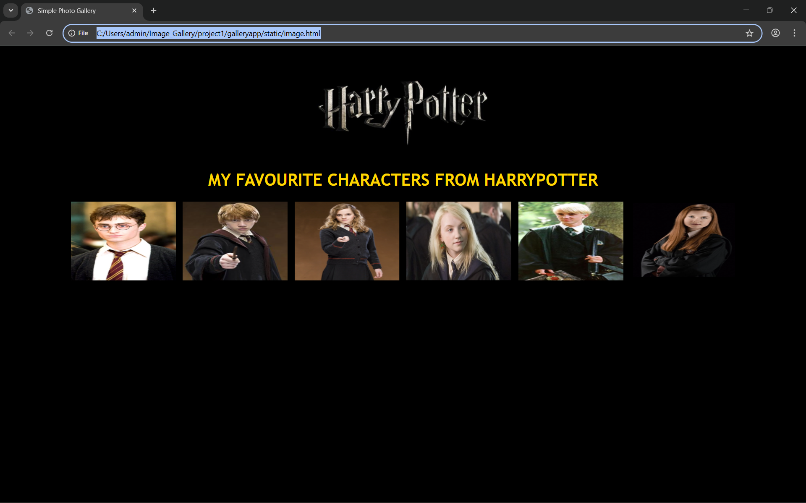
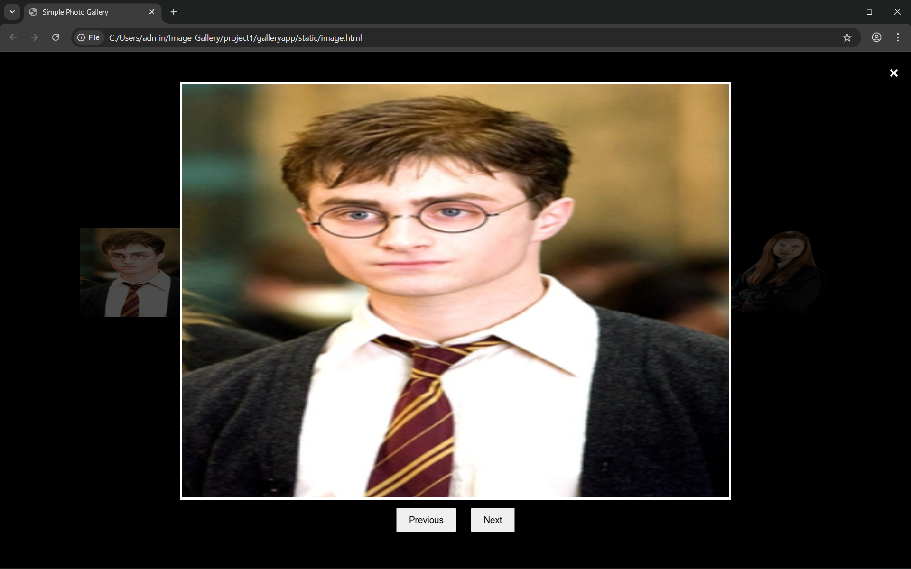
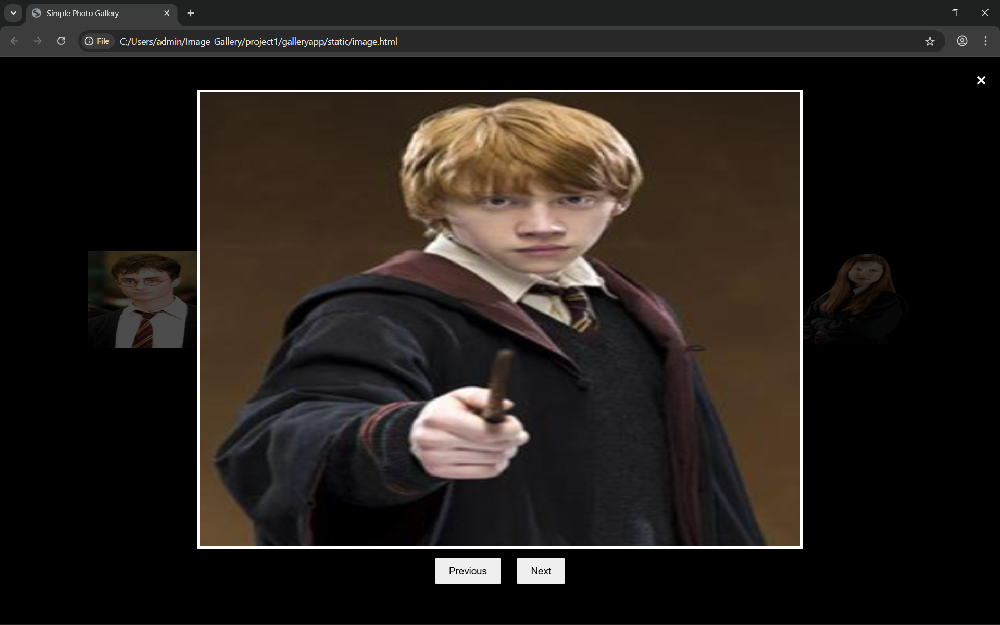
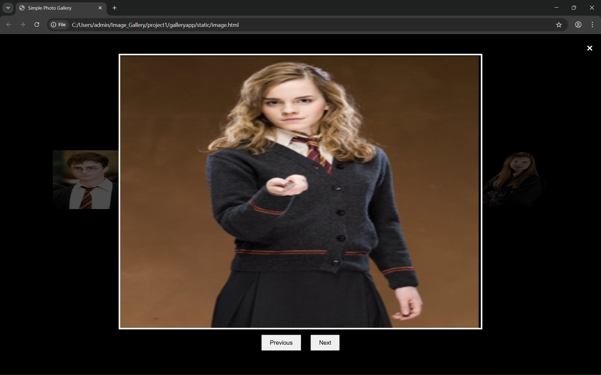
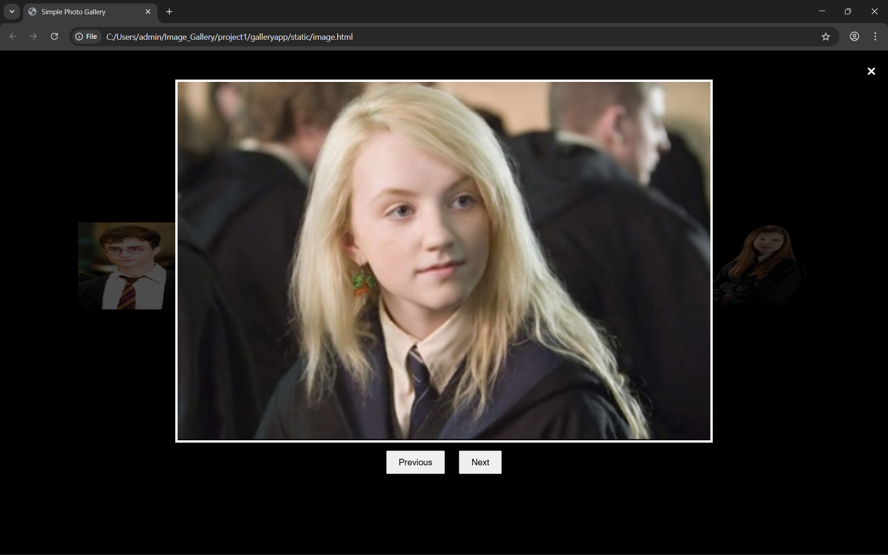
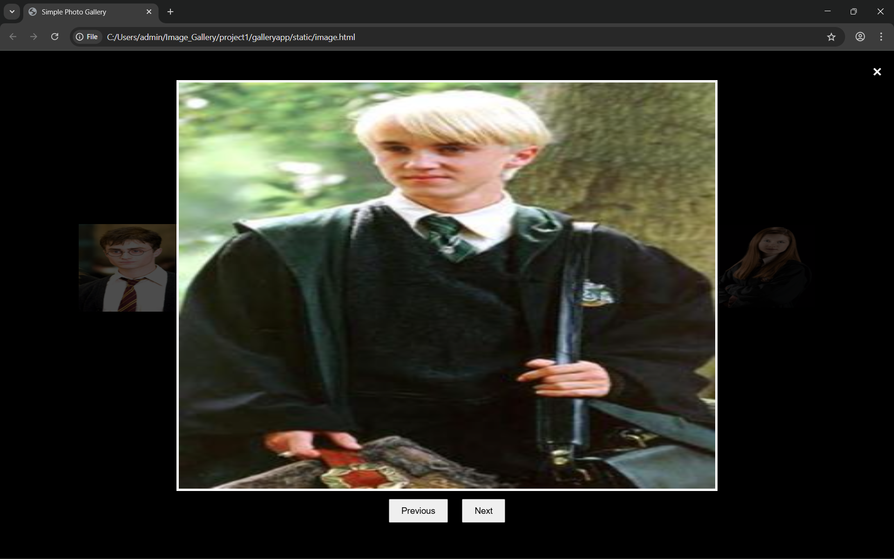

# Ex.08 Design of Interactive Image Gallery

## AIM
  To design a web application for an inteactive image gallery with minimum five images.

## DESIGN STEPS

## Step 1:

Clone the github repository and create Django admin interface

## Step 2:

Change settings.py file to allow request from all hosts.

## Step 3:

Use CSS for positioning and styling.

## Step 4:

Write JavaScript program for implementing interactivit

## Step 5:

Validate the HTML and CSS code

## Step 6:

Publish the website in the given URL.

## PROGRAM

```
<!DOCTYPE html>
<html lang="en">
<head>
    <meta charset="UTF-8">
    <meta name="viewport" content="width=device-width, initial-scale=1.0">
    <title>Simple Photo Gallery</title>

    <style>
        body {
            font-family: Arial, sans-serif;
            padding: 20px;
            text-align: center;
            background-color: #000;
        }

        img.logo {
            width: 400px;
            height:200px   /* change size if needed */
        }

        h1 {
            margin-top: 5px;
            font-family: 'Trebuchet MS', 'Lucida Sans Unicode', 'Lucida Grande', 'Lucida Sans', Arial, sans-serif;
            color: #FFD700;

        }

        .gallery {
            display: flex;
            flex-wrap: wrap;
            gap: 10px;
            justify-content: center;
        }

        .gallery img {
            width: 200px;
            height: 150px;
            cursor: pointer;
            border: 2px solid #000;
        }

        /* Lightbox */
        #lightbox {
            display: none;
            position: fixed;
            left: 0;
            top: 0;
            width: 100%;
            height: 100%;
            background: rgba(0,0,0,0.7);
            text-align: center;
            padding-top: 50px;
        }

        #lightbox img {
            width: 60%;
            max-height: 80%;
            border: 4px solid white;
        }

        .controls button {
            margin: 10px;
            padding: 10px 20px;
            font-size: 15px;
        }

        .close {
            color: white;
            font-size: 30px;
            position: absolute;
            right: 20px;
            top: 20px;
            cursor: pointer;
        }
    </style>
</head>

<body>
    

    <h1>MY FAVOURITE CHARACTERS FROM HARRYPOTTER</h1>

    <div class="gallery">
        
        
        
        
        
        
    </div>

    <div id="lightbox">
        <span class="close">&times;</span>
        
        <div class="controls">
            <button id="prev">Previous</button>
            <button id="next">Next</button>
        </div>
    </div>

    <script>
        let images = document.querySelectorAll(".gallery img");
        let lightbox = document.getElementById("lightbox");
        let lightImg = document.getElementById("lightbox-img");
        let closeBtn = document.querySelector(".close");
        let nextBtn = document.getElementById("next");
        let prevBtn = document.getElementById("prev");

        let index = 0;

        images.forEach((img, i) => {
            img.addEventListener("click", () => {
                index = i;
                lightImg.src = img.src;
                lightbox.style.display = "block";
            });
        });

        closeBtn.onclick = function() {
            lightbox.style.display = "none";
        };

        nextBtn.onclick = function() {
            index = (index + 1) % images.length;
            lightImg.src = images[index].src;
        };

        prevBtn.onclick = function() {
            index = (index - 1 + images.length) % images.length;
            lightImg.src = images[index].src;
        };

        lightbox.addEventListener("click", function(e) {
            if (e.target === lightbox) {
                lightbox.style.display = "none";
            }
        });
    </script>

</body>
</html>
```

## OUTPUT








## RESULT
  The program for designing an interactive image gallery using HTML, CSS and JavaScript is executed successfully.
